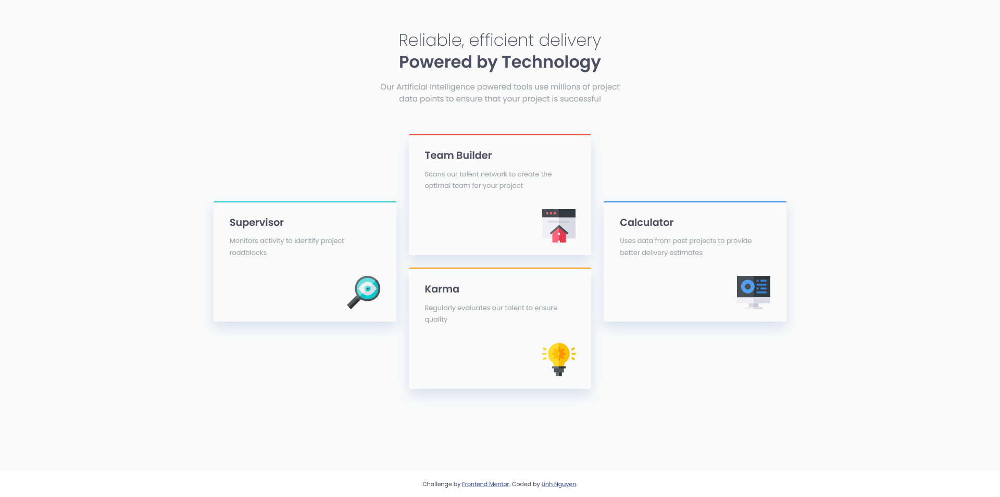
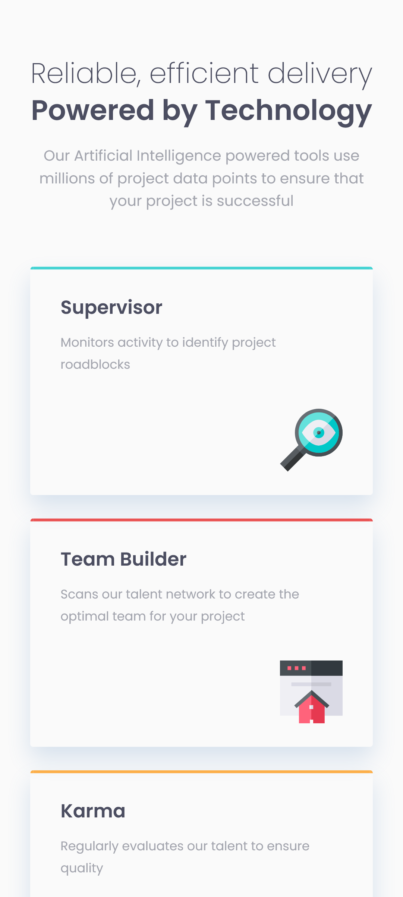

# Frontend Mentor - Four card feature section solution

## Table of contents

- [Overview](#overview)
  - [The challenge](#the-challenge)
  - [Screenshot](#screenshot)
  - [Links](#links)
- [My process](#my-process)
  - [Built with](#built-with)
  - [What I learned](#what-i-learned)
  - [Continued development](#continued-development)
- [Author](#author)


## Overview

### The challenge

Users should be able to:

- View the optimal layout for the site depending on their device's screen size

### Screenshot

_1. Desktop design_



_2. Mobile design_



### Links

<!-- - Solution URL: [Add solution URL here](https://your-solution-url.com) -->
- Live Site URL: [Four cards feature section page](https://auri222.github.io/Four-cards-feature-section-with-HTML-CSS/)

## My process

### Built with

- Semantic HTML5 markup
- CSS custom properties
- Flexbox

### What I learned

- How to use Flexbox and control its item

```css
.flexbox {
  max-width: 1100px;
  display: flex;
  column-gap: 1.5rem;
}

.flexbox > * {
  flex: 1;
}
```
> With all flex items set to flex: 1 => Each items will have a similar width 
> flex: 1 or flex: 1 1 0, flex: 2 or flex: 2 1 0 and so on, respectively. The items can grow and shrink from a flex-basis of 0 - Read more from [Basic concepts of flexbox - MDN Web Docs](https://developer.mozilla.org/en-US/docs/Web/CSS/CSS_flexible_box_layout/Basic_concepts_of_flexbox#multi-line_flex_containers_with_flex-wrap)

### Continued development

- Maybe I will use grid for the main section for further learning progress.

## Author

- Frontend Mentor - [@auri222](https://www.frontendmentor.io/profile/auri222)